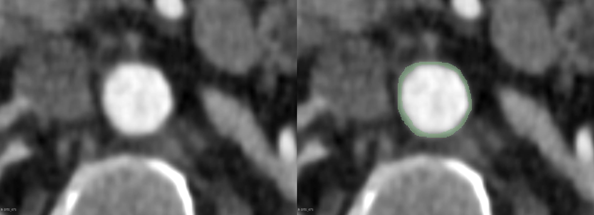

# Automatic Segmentation of the Aortic Wall from CT Scans with U-Net
NOTE: this is a fork of the original repository by [s194255](https://github.com/s194255) and I. 

Repository for segmentation of the aortic walls from CT scans using U-Nets trained on sparse annotations. The repository provides code for training and evaluating the standard U-net and the contextual U-Net, as well as code for 3D interpolations of sparse 2D annotations.

Read our paper [here](figures/paper/Automatic%20Segmentation%20of%20the%20Aortic%20Wall%20from%20CT%20Scans%20with%20U-Net.pdf).

# Getting started
Clone this repo:
```bash
git clone https://github.com/TECH-yufu/DTUWallSegmentation.git
cd DTUWallSegmentation
```
Create conda environment and install dependencies:
```bash
conda env create -f requirements.yaml
conda activate DTUAorta
```
# Data
The data consists of semi-manually annotated images of the aortic wall. 

 

# Training
The basic model can be trained with the following:
```bash
python train.py --batch_size 64 --img_size 512 --lr 3e-3 --data_path "data_path" --dataloader_type "2D"
```
where "data_path" is the path with the train, val, and test folders. Each folder should contain a separate folder with images and annotated labels.

To train using 3D interpolated annotations add the flag ``--dataloader_typ "3D"``, and add the flag ``--contextual`` to use the contextual U-Net.

# Evaluate and test
To evaluate a trained model and test the segmentations, run the following:
```bash
python test.py --model_path "model_path" --data_path "data_path" --save_path "save_path" --batch_size 1 
```
with the correct paths. For the contextual U-Net, add the flag ``--contextual``. 